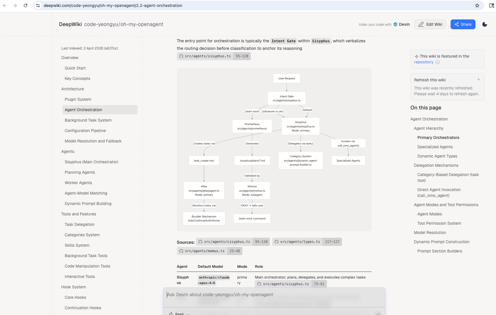

# AIShare

- Use this repo to share AI learning FREE

- share folder has notes in markdown, start with [InitShare04052026.md](https://github.com/yinghe1/aishare/blob/main/share/InitialShare04052026.md)

- courses folder has [codebase-to-course](https://github.com/zarazhangrui/codebase-to-course) or other method generated courses for AI learning

- Sample generated course: [oh-my-opencode-course](https://yinghe1.github.io/aishare/courses/oh-my-opencode-course/). Format to access after you checkin to `github: https://<username>.github.io/<repo>/subfolder/`

- If you want more technical wiki for codebase:
    -  You can use deepwiki. Here is a sample :[oh-my-openagent deepwiki](https://deepwiki.com/code-yeongyu/oh-my-openagent/2.2-agent-orchestration) 
    -  From codebase to diagram: [oh-my-mermaid](https://github.com/oh-my-mermaid/oh-my-mermaid)

MIT License